# PharmaMind AI — System Flow

## 1. Mục tiêu tài liệu

Tài liệu này mô tả lưu đồ tổng thể của hệ thống **PharmaMind AI** theo kiến trúc hiện tại, trong đó phần cứng thật chưa hoàn thiện và được thay thế tạm thời bằng **Hardware Simulator / Mock Cabinet**.

Hệ thống hiện tại tập trung vào:

- quản lý gia đình;
- quản lý hồ sơ sức khỏe;
- quản lý thuốc;
- quản lý đơn thuốc;
- lịch uống thuốc;
- Digital Twin 3D của tủ thuốc;
- quản lý tồn kho;
- cảnh báo dị ứng/phản ứng thuốc;
- notification;
- AI Pharmacist;
- Hardware Simulator.

---

# 2. Lưu đồ tổng thể hệ thống

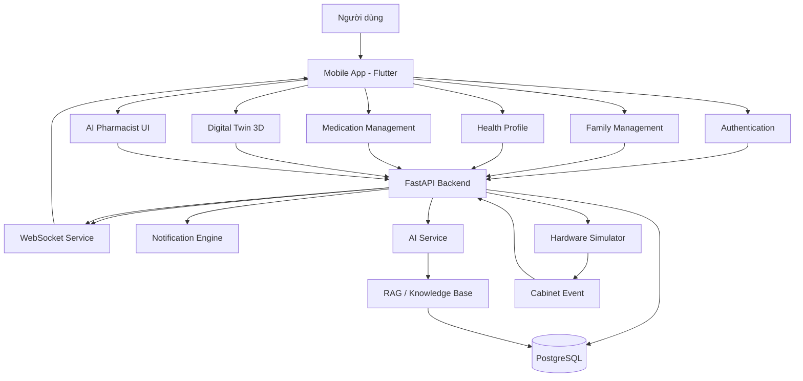
```mermaid
flowchart TD

    U[Người dùng] --> APP[Mobile App - Flutter]

    APP --> AUTH[Authentication]
    APP --> FAMILY[Family Management]
    APP --> HEALTH[Health Profile]
    APP --> MED[Medication Management]
    APP --> DT[Digital Twin 3D]
    APP --> AIUI[AI Pharmacist UI]

    AUTH --> API[FastAPI Backend]
    FAMILY --> API
    HEALTH --> API
    MED --> API
    DT --> API
    AIUI --> API

    API --> DB[(PostgreSQL)]
    API --> WS[WebSocket Service]
    API --> NOTI[Notification Engine]
    API --> AICORE[AI Service]
    API --> MOCK[Hardware Simulator]

    AICORE --> RAG[RAG / Knowledge Base]
    RAG --> DB

    MOCK --> EVENT[Cabinet Event]
    EVENT --> API

    API --> WS
    WS --> APP
```

---

# 3. Luồng người dùng chính

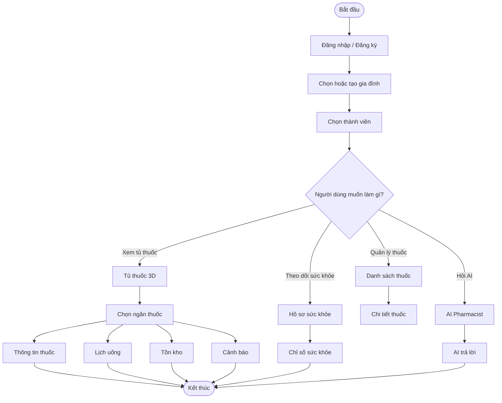
```mermaid
flowchart TD

    START([Bắt đầu]) --> LOGIN[Đăng nhập / Đăng ký]

    LOGIN --> FAMILY[Chọn hoặc tạo gia đình]

    FAMILY --> MEMBER[Chọn thành viên]

    MEMBER --> ACTION{Người dùng muốn làm gì?}

    ACTION -->|Quản lý thuốc| MED[Danh sách thuốc]
    ACTION -->|Theo dõi sức khỏe| HEALTH[Hồ sơ sức khỏe]
    ACTION -->|Xem tủ thuốc| CABINET[Tủ thuốc 3D]
    ACTION -->|Hỏi AI| AI[AI Pharmacist]

    MED --> MEDDETAIL[Chi tiết thuốc]
    HEALTH --> METRIC[Chỉ số sức khỏe]
    CABINET --> COMPARTMENT[Chọn ngăn thuốc]
    AI --> AIANSWER[AI trả lời]

    COMPARTMENT --> DRUGINFO[Thông tin thuốc]
    COMPARTMENT --> SCHEDULE[Lịch uống]
    COMPARTMENT --> STOCK[Tồn kho]
    COMPARTMENT --> WARNING[Cảnh báo]

    DRUGINFO --> END([Kết thúc])
    SCHEDULE --> END
    STOCK --> END
    WARNING --> END
    METRIC --> END
    AIANSWER --> END
```

---

# 4. Luồng quản lý thành viên gia đình

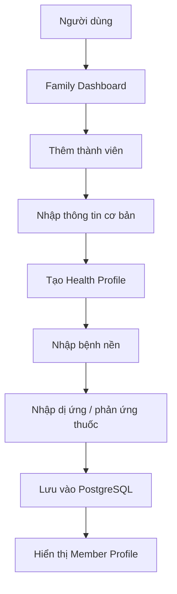
```mermaid
flowchart TD

    A[Người dùng] --> B[Family Dashboard]

    B --> C[Thêm thành viên]

    C --> D[Nhập thông tin cơ bản]

    D --> E[Tạo Health Profile]

    E --> F[Nhập bệnh nền]

    F --> G[Nhập dị ứng / phản ứng thuốc]

    G --> H[Lưu vào PostgreSQL]

    H --> I[Hiển thị Member Profile]
```

---

# 5. Luồng thêm thuốc

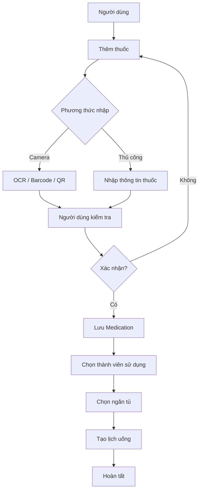
```mermaid
flowchart TD

    A[Người dùng] --> B[Thêm thuốc]

    B --> C{Phương thức nhập}

    C -->|Thủ công| MANUAL[Nhập thông tin thuốc]
    C -->|Camera| OCR[OCR / Barcode / QR]

    OCR --> REVIEW[Người dùng kiểm tra]
    MANUAL --> REVIEW

    REVIEW --> CONFIRM{Xác nhận?}

    CONFIRM -->|Không| B
    CONFIRM -->|Có| SAVE[Lưu Medication]

    SAVE --> ASSIGN[Chọn thành viên sử dụng]

    ASSIGN --> CABINET[Chọn ngăn tủ]

    CABINET --> SCHEDULE[Tạo lịch uống]

    SCHEDULE --> DONE[Hoàn tất]
```

---

# 6. Luồng đơn thuốc

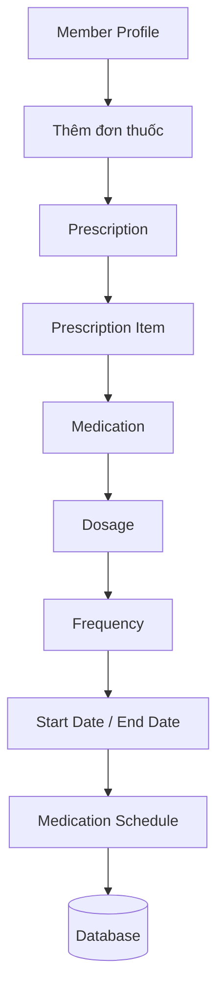
```mermaid
flowchart TD

    A[Member Profile] --> B[Thêm đơn thuốc]

    B --> C[Prescription]

    C --> D[Prescription Item]

    D --> E[Medication]

    E --> F[Dosage]

    F --> G[Frequency]

    G --> H[Start Date / End Date]

    H --> I[Medication Schedule]

    I --> J[(Database)]
```

---

# 7. Luồng lịch uống thuốc

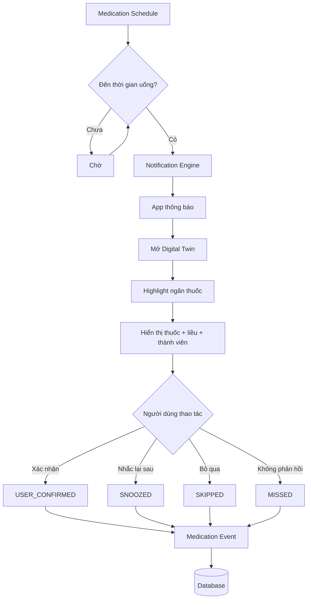
```mermaid
flowchart TD

    A[Medication Schedule] --> B{Đến thời gian uống?}

    B -->|Chưa| WAIT[Chờ]

    WAIT --> B

    B -->|Có| REMINDER[Notification Engine]

    REMINDER --> APP[App thông báo]

    APP --> OPEN3D[Mở Digital Twin]

    OPEN3D --> HIGHLIGHT[Highlight ngăn thuốc]

    HIGHLIGHT --> DETAIL[Hiển thị thuốc + liều + thành viên]

    DETAIL --> ACTION{Người dùng thao tác}

    ACTION -->|Xác nhận| CONFIRMED[USER_CONFIRMED]

    ACTION -->|Nhắc lại sau| SNOOZE[SNOOZED]

    ACTION -->|Bỏ qua| SKIP[SKIPPED]

    ACTION -->|Không phản hồi| MISSED[MISSED]

    CONFIRMED --> EVENT[Medication Event]
    SNOOZE --> EVENT
    SKIP --> EVENT
    MISSED --> EVENT

    EVENT --> DB[(Database)]
```

---

# 8. Luồng Digital Twin 3D

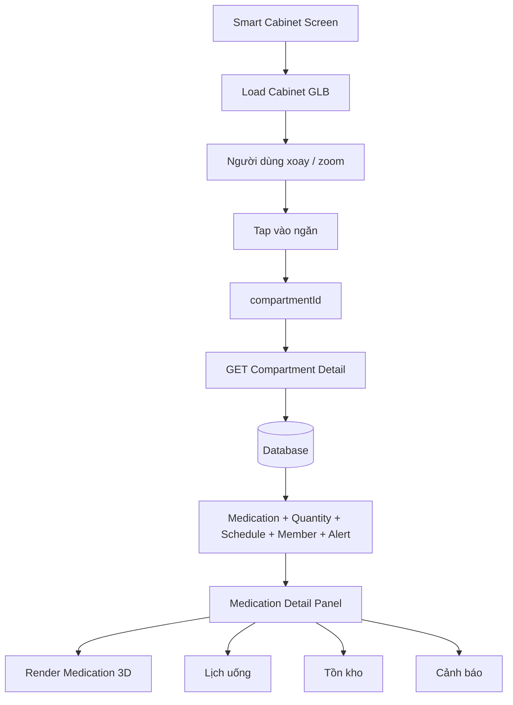
```mermaid
flowchart TD

    APP[Smart Cabinet Screen] --> MODEL[Load Cabinet GLB]

    MODEL --> USER[Người dùng xoay / zoom]

    USER --> TAP[Tap vào ngăn]

    TAP --> ID[compartmentId]

    ID --> API[GET Compartment Detail]

    API --> DB[(Database)]

    DB --> DATA[Medication + Quantity + Schedule + Member + Alert]

    DATA --> PANEL[Medication Detail Panel]

    PANEL --> MODEL3D[Render Medication 3D]

    PANEL --> SCHEDULE[Lịch uống]

    PANEL --> STOCK[Tồn kho]

    PANEL --> WARNING[Cảnh báo]
```

---

# 9. Luồng hiển thị viên thuốc 3D

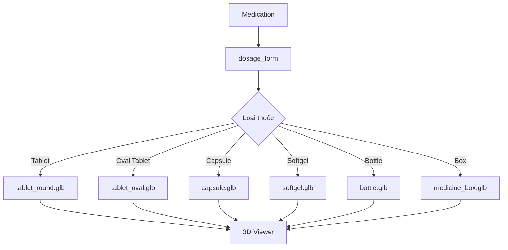
```mermaid
flowchart TD

    MED[Medication] --> TYPE[dosage_form]

    TYPE --> MAP{Loại thuốc}

    MAP -->|Tablet| TABLET[tablet_round.glb]
    MAP -->|Oval Tablet| OVAL[tablet_oval.glb]
    MAP -->|Capsule| CAPSULE[capsule.glb]
    MAP -->|Softgel| SOFTGEL[softgel.glb]
    MAP -->|Bottle| BOTTLE[bottle.glb]
    MAP -->|Box| BOX[medicine_box.glb]

    TABLET --> RENDER[3D Viewer]
    OVAL --> RENDER
    CAPSULE --> RENDER
    SOFTGEL --> RENDER
    BOTTLE --> RENDER
    BOX --> RENDER
```

> Lưu ý: mô hình 3D chỉ dùng để trực quan hóa, không dùng để nhận dạng thuốc thực tế.

---

# 10. Luồng quản lý tồn kho

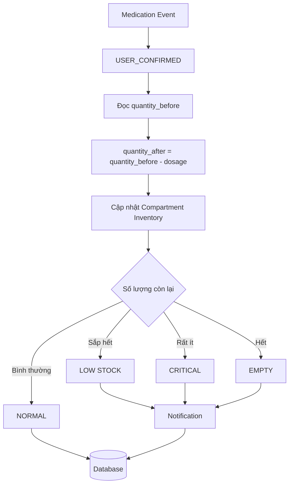
```mermaid
flowchart TD

    A[Medication Event] --> B[USER_CONFIRMED]

    B --> C[Đọc quantity_before]

    C --> D[quantity_after = quantity_before - dosage]

    D --> E[Cập nhật Compartment Inventory]

    E --> F{Số lượng còn lại}

    F -->|Bình thường| NORMAL[NORMAL]

    F -->|Sắp hết| LOW[LOW STOCK]

    F -->|Rất ít| CRITICAL[CRITICAL]

    F -->|Hết| EMPTY[EMPTY]

    NORMAL --> DB[(Database)]
    LOW --> NOTI[Notification]
    CRITICAL --> NOTI
    EMPTY --> NOTI

    NOTI --> DB
```

---

# 11. Luồng cảnh báo hết hạn

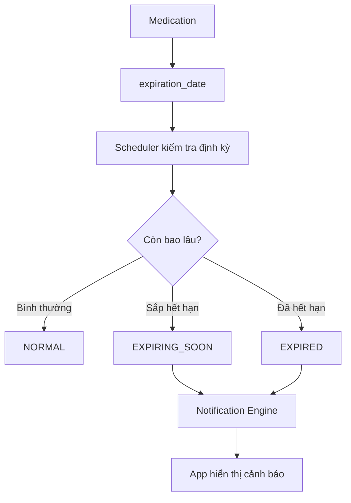
```mermaid
flowchart TD

    A[Medication] --> B[expiration_date]

    B --> C[Scheduler kiểm tra định kỳ]

    C --> D{Còn bao lâu?}

    D -->|Bình thường| NORMAL[NORMAL]

    D -->|Sắp hết hạn| EXPIRING[EXPIRING_SOON]

    D -->|Đã hết hạn| EXPIRED[EXPIRED]

    EXPIRING --> NOTI[Notification Engine]

    EXPIRED --> NOTI

    NOTI --> APP[App hiển thị cảnh báo]
```

---

# 12. Luồng cảnh báo dị ứng / phản ứng thuốc

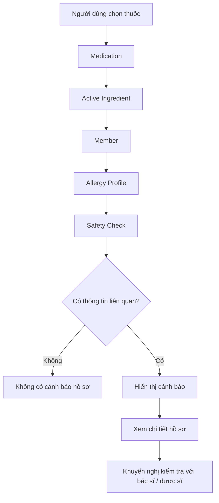
```mermaid
flowchart TD

    A[Người dùng chọn thuốc] --> B[Medication]

    B --> C[Active Ingredient]

    C --> D[Member]

    D --> E[Allergy Profile]

    E --> F[Safety Check]

    F --> G{Có thông tin liên quan?}

    G -->|Không| SAFE[Không có cảnh báo hồ sơ]

    G -->|Có| WARNING[Hiển thị cảnh báo]

    WARNING --> DETAIL[Xem chi tiết hồ sơ]

    DETAIL --> ADVICE[Khuyến nghị kiểm tra với bác sĩ / dược sĩ]
```

Hệ thống không được tự kết luận:

```text
Thuốc này chắc chắn gây phản vệ.
```

Nên hiển thị:

```text
Hồ sơ của thành viên có thông tin dị ứng hoặc phản ứng thuốc cần kiểm tra.
```

---

# 13. Luồng Hardware Simulator

Trong giai đoạn chưa hoàn thiện phần cứng thật, hệ thống sử dụng **Hardware Simulator**.

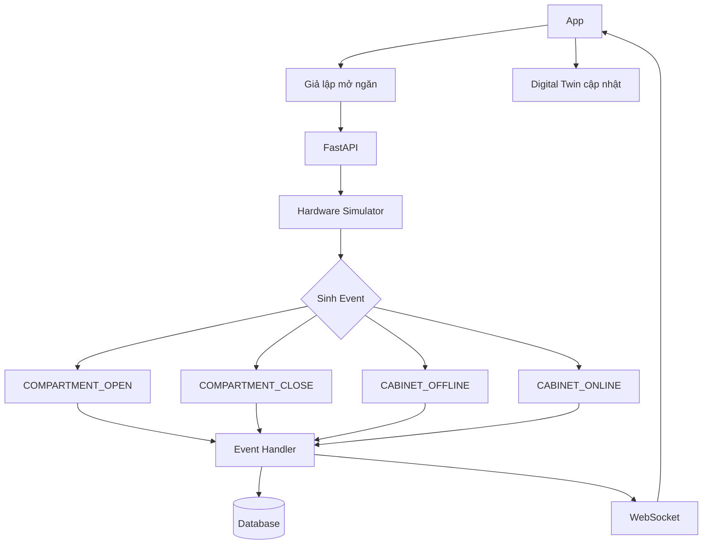
```mermaid
flowchart TD

    APP[App] --> OPEN[Giả lập mở ngăn]

    OPEN --> API[FastAPI]

    API --> SIM[Hardware Simulator]

    SIM --> EVENT{Sinh Event}

    EVENT --> OPEN_EVENT[COMPARTMENT_OPEN]
    EVENT --> CLOSE_EVENT[COMPARTMENT_CLOSE]
    EVENT --> OFFLINE_EVENT[CABINET_OFFLINE]
    EVENT --> ONLINE_EVENT[CABINET_ONLINE]

    OPEN_EVENT --> BACKEND[Event Handler]
    CLOSE_EVENT --> BACKEND
    OFFLINE_EVENT --> BACKEND
    ONLINE_EVENT --> BACKEND

    BACKEND --> DB[(Database)]

    BACKEND --> WS[WebSocket]

    WS --> APP

    APP --> DT[Digital Twin cập nhật]
```

---

# 14. Luồng phần cứng thật trong tương lai

Khi phần cứng hoàn thiện, Hardware Simulator được thay thế bằng ESP32.

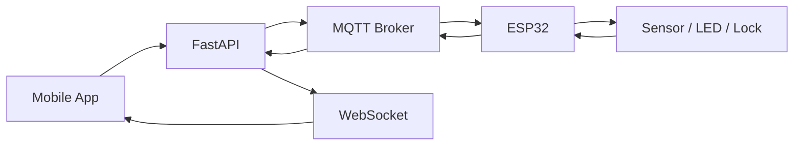
```mermaid
flowchart LR

    APP[Mobile App] --> API[FastAPI]

    API --> MQTT[MQTT Broker]

    MQTT --> ESP32[ESP32]

    ESP32 --> SENSOR[Sensor / LED / Lock]

    SENSOR --> ESP32

    ESP32 --> MQTT

    MQTT --> API

    API --> WS[WebSocket]

    WS --> APP
```

Điểm quan trọng:

```text
Mock Hardware
     ↓
thay bằng
     ↓
ESP32 + MQTT
```

Các module App, Database, Medication và Digital Twin không cần viết lại toàn bộ.

---

# 15. Luồng WebSocket realtime

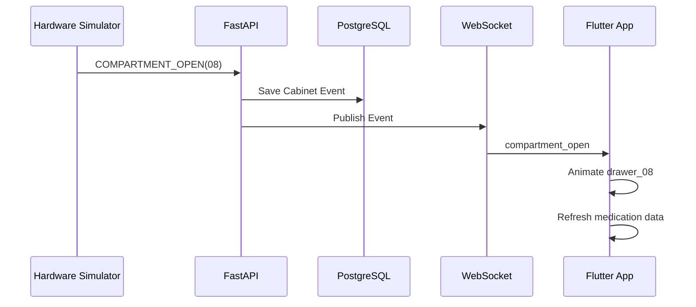
```mermaid
sequenceDiagram

    participant SIM as Hardware Simulator
    participant API as FastAPI
    participant DB as PostgreSQL
    participant WS as WebSocket
    participant APP as Flutter App

    SIM->>API: COMPARTMENT_OPEN(08)
    API->>DB: Save Cabinet Event
    API->>WS: Publish Event
    WS->>APP: compartment_open
    APP->>APP: Animate drawer_08
    APP->>APP: Refresh medication data
```

---

# 16. Luồng Medication Event

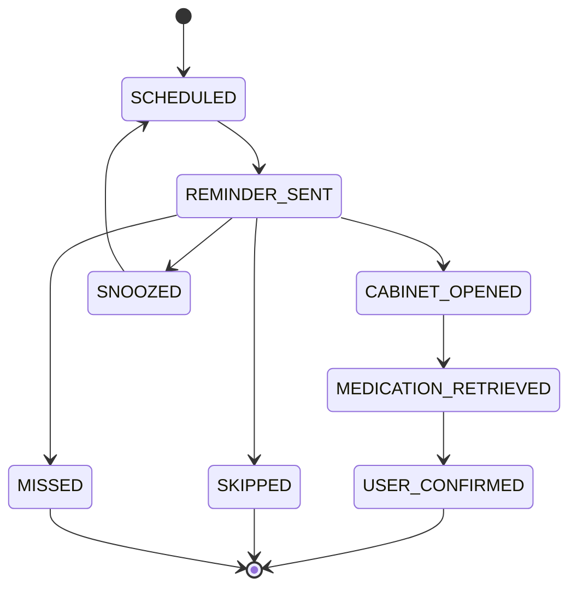
```mermaid
stateDiagram-v2

    [*] --> SCHEDULED

    SCHEDULED --> REMINDER_SENT

    REMINDER_SENT --> CABINET_OPENED

    CABINET_OPENED --> MEDICATION_RETRIEVED

    MEDICATION_RETRIEVED --> USER_CONFIRMED

    REMINDER_SENT --> SNOOZED

    REMINDER_SENT --> SKIPPED

    REMINDER_SENT --> MISSED

    USER_CONFIRMED --> [*]

    SNOOZED --> SCHEDULED

    SKIPPED --> [*]

    MISSED --> [*]
```

---

# 17. Luồng Caregiver

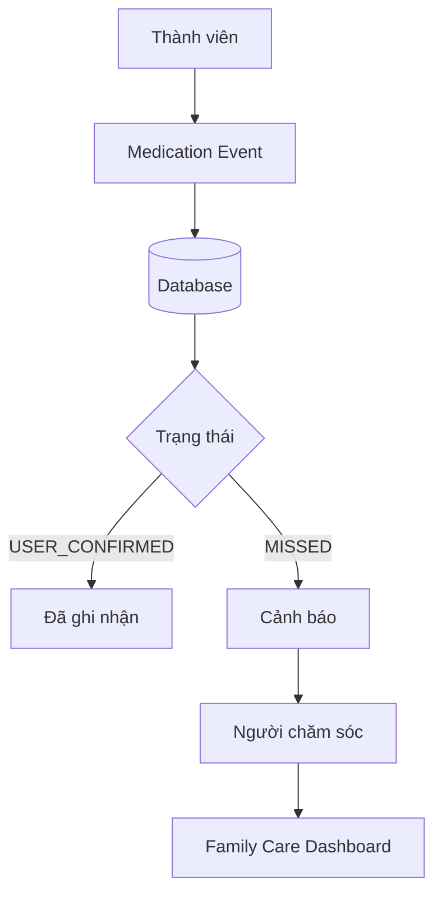
```mermaid
flowchart TD

    MEMBER[Thành viên] --> EVENT[Medication Event]

    EVENT --> DB[(Database)]

    DB --> CHECK{Trạng thái}

    CHECK -->|USER_CONFIRMED| DONE[Đã ghi nhận]

    CHECK -->|MISSED| ALERT[Cảnh báo]

    ALERT --> CAREGIVER[Người chăm sóc]

    CAREGIVER --> APP[Family Care Dashboard]
```

---

# 18. Luồng AI Pharmacist

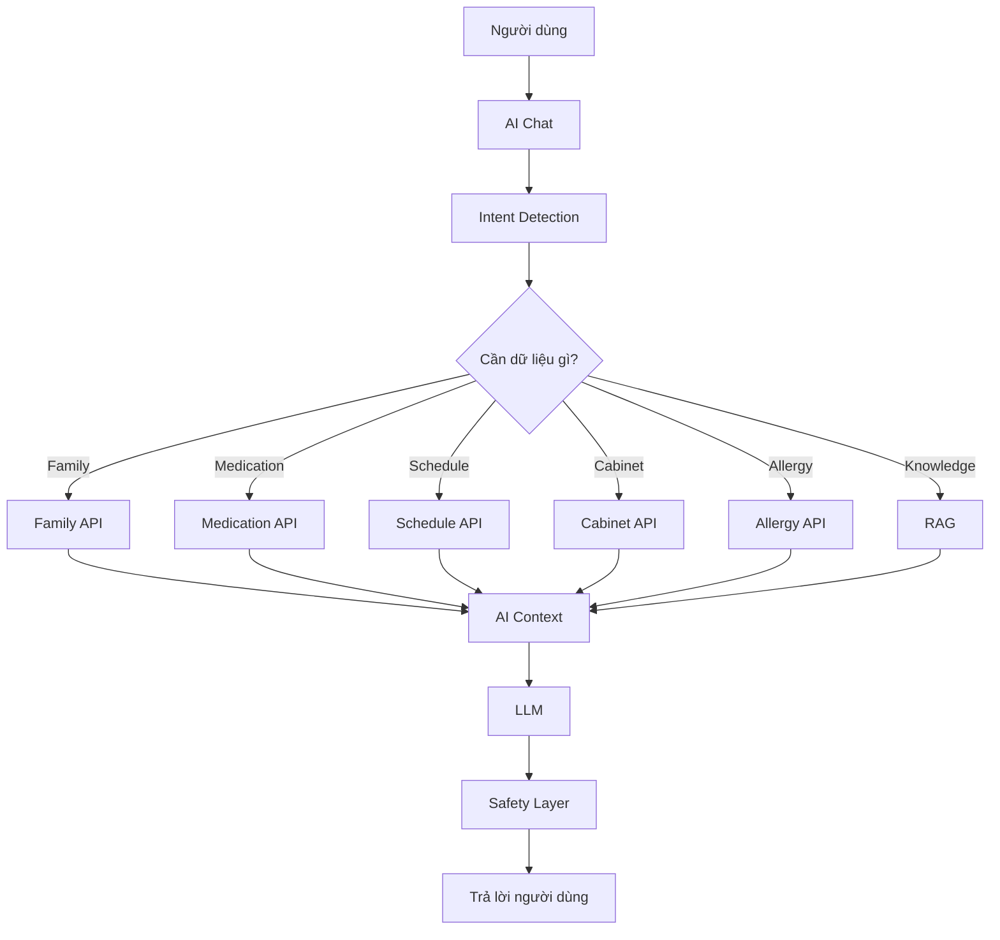
```mermaid
flowchart TD

    USER[Người dùng] --> CHAT[AI Chat]

    CHAT --> INTENT[Intent Detection]

    INTENT --> ROUTE{Cần dữ liệu gì?}

    ROUTE -->|Family| FAMILY[Family API]
    ROUTE -->|Medication| MED[Medication API]
    ROUTE -->|Schedule| SCHEDULE[Schedule API]
    ROUTE -->|Cabinet| CABINET[Cabinet API]
    ROUTE -->|Allergy| ALLERGY[Allergy API]
    ROUTE -->|Knowledge| RAG[RAG]

    FAMILY --> CONTEXT[AI Context]
    MED --> CONTEXT
    SCHEDULE --> CONTEXT
    CABINET --> CONTEXT
    ALLERGY --> CONTEXT
    RAG --> CONTEXT

    CONTEXT --> LLM[LLM]

    LLM --> SAFETY[Safety Layer]

    SAFETY --> ANSWER[Trả lời người dùng]
```

---

# 19. Luồng AI điều hướng Digital Twin

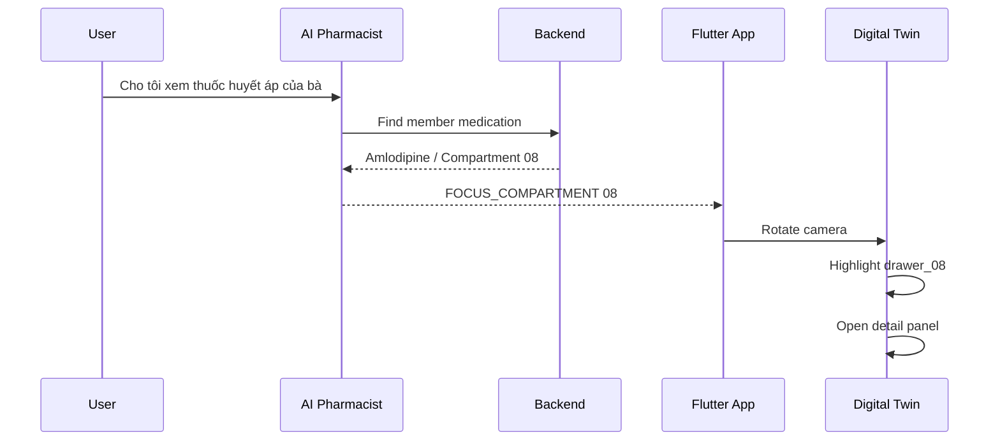
```mermaid
sequenceDiagram

    participant USER as User
    participant AI as AI Pharmacist
    participant API as Backend
    participant APP as Flutter App
    participant DT as Digital Twin

    USER->>AI: Cho tôi xem thuốc huyết áp của bà

    AI->>API: Find member medication
    API-->>AI: Amlodipine / Compartment 08

    AI-->>APP: FOCUS_COMPARTMENT 08

    APP->>DT: Rotate camera
    DT->>DT: Highlight drawer_08
    DT->>DT: Open detail panel
```

---

# 20. Luồng dữ liệu tổng thể

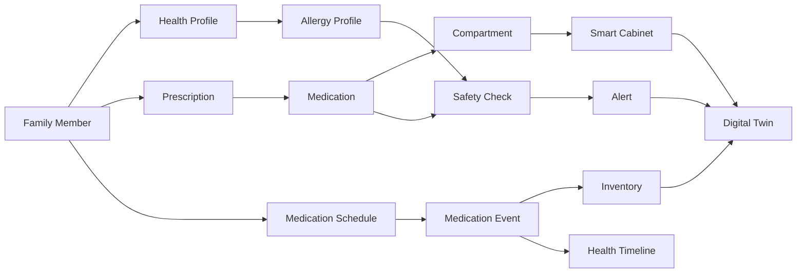
```mermaid
flowchart LR

    MEMBER[Family Member]

    MEMBER --> PROFILE[Health Profile]
    MEMBER --> RX[Prescription]
    MEMBER --> SCHEDULE[Medication Schedule]

    RX --> MED[Medication]

    MED --> COMP[Compartment]

    COMP --> CABINET[Smart Cabinet]

    SCHEDULE --> EVENT[Medication Event]

    EVENT --> INVENTORY[Inventory]

    EVENT --> TIMELINE[Health Timeline]

    PROFILE --> ALLERGY[Allergy Profile]

    ALLERGY --> SAFETY[Safety Check]

    MED --> SAFETY

    SAFETY --> ALERT[Alert]

    CABINET --> DIGITAL[Digital Twin]

    INVENTORY --> DIGITAL

    ALERT --> DIGITAL
```

---

# 21. Kiến trúc dữ liệu

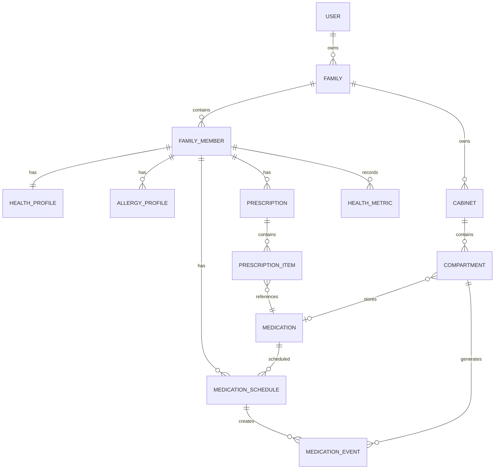
```mermaid
erDiagram

    USER ||--o{ FAMILY : owns

    FAMILY ||--o{ FAMILY_MEMBER : contains

    FAMILY_MEMBER ||--|| HEALTH_PROFILE : has

    FAMILY_MEMBER ||--o{ ALLERGY_PROFILE : has

    FAMILY_MEMBER ||--o{ PRESCRIPTION : has

    PRESCRIPTION ||--o{ PRESCRIPTION_ITEM : contains

    PRESCRIPTION_ITEM }o--|| MEDICATION : references

    FAMILY_MEMBER ||--o{ MEDICATION_SCHEDULE : has

    MEDICATION ||--o{ MEDICATION_SCHEDULE : scheduled

    FAMILY ||--o{ CABINET : owns

    CABINET ||--o{ COMPARTMENT : contains

    COMPARTMENT }o--o| MEDICATION : stores

    MEDICATION_SCHEDULE ||--o{ MEDICATION_EVENT : creates

    COMPARTMENT ||--o{ MEDICATION_EVENT : generates

    FAMILY_MEMBER ||--o{ HEALTH_METRIC : records
```

---

# 22. Kiến trúc triển khai hiện tại

```mermaid
flowchart TD

    FLUTTER[Flutter Mobile App]

    FLUTTER --> FASTAPI[FastAPI Backend]

    FASTAPI --> POSTGRES[(PostgreSQL)]

    FASTAPI --> REDIS[(Redis - optional)]

    FASTAPI --> WS[WebSocket]

    FASTAPI --> SIM[Hardware Simulator]

    FASTAPI --> AI[AI Service]

    AI --> PGVECTOR[(pgvector)]

    SIM --> FASTAPI

    WS --> FLUTTER
```

---

# 23. Kiến trúc triển khai tương lai

```mermaid
flowchart TD

    APP[Flutter App]

    APP --> API[FastAPI]

    API --> DB[(PostgreSQL)]

    API --> REDIS[(Redis)]

    API --> AI[AI Service]

    API --> MQTT[EMQX / Mosquitto]

    MQTT --> DEVICE[ESP32 Cabinet]

    DEVICE --> SENSOR[Sensor]

    DEVICE --> LED[LED]

    DEVICE --> LOCK[Lock / Motor]

    MQTT --> API

    API --> WS[WebSocket]

    WS --> APP
```

---

# 24. Lưu đồ MVP hiện tại

Đây là luồng quan trọng nhất cần hoàn thiện trước.

```mermaid
flowchart TD

    A[Tạo tài khoản]

    A --> B[Tạo Family]

    B --> C[Tạo Member]

    C --> D[Thêm Medication]

    D --> E[Tạo Prescription]

    E --> F[Tạo Medication Schedule]

    F --> G[Gán Medication vào Compartment]

    G --> H[Digital Twin hiển thị thuốc]

    H --> I[Đến giờ uống]

    I --> J[Notification]

    J --> K[Highlight ngăn 3D]

    K --> L[Xem Medication Detail]

    L --> M[Giả lập mở ngăn]

    M --> N[Hardware Simulator]

    N --> O[COMPARTMENT_OPEN]

    O --> P[Medication Event]

    P --> Q[Cập nhật tồn kho]

    Q --> R[WebSocket]

    R --> S[App cập nhật realtime]
```

---

# 25. Mục tiêu hoàn thiện phần mềm trước phần cứng

Hệ thống được coi là đạt MVP phần mềm khi có thể chạy được toàn bộ chuỗi:

```text
LOGIN
  ↓
FAMILY
  ↓
MEMBER
  ↓
MEDICATION
  ↓
PRESCRIPTION
  ↓
SCHEDULE
  ↓
CABINET
  ↓
DIGITAL TWIN
  ↓
SELECT COMPARTMENT
  ↓
VIEW MEDICATION
  ↓
REMINDER
  ↓
MOCK OPEN
  ↓
MEDICATION EVENT
  ↓
INVENTORY UPDATE
  ↓
REALTIME UPDATE
```

Sau khi phần cứng thật hoàn thiện:

```text
Hardware Simulator
```

được thay bằng:

```text
ESP32 + MQTT + Sensors + Locks
```

mà không thay đổi kiến trúc nghiệp vụ cốt lõi của hệ thống.

---

# 26. Kết luận

Kiến trúc PharmaMind AI hiện tại được thiết kế theo nguyên tắc:

```text
Software First
      +
Hardware Independent
      +
Digital Twin
      +
Family Health Data
      +
AI Ready
```

Điều này cho phép nhóm phát triển:

- hoàn thiện App trước;
- hoàn thiện Backend trước;
- kiểm thử toàn bộ nghiệp vụ bằng Mock Hardware;
- xây dựng Digital Twin độc lập với tủ thật;
- bổ sung ESP32 sau mà không phải viết lại hệ thống;
- bổ sung AI sau khi dữ liệu nền đã ổn định.
